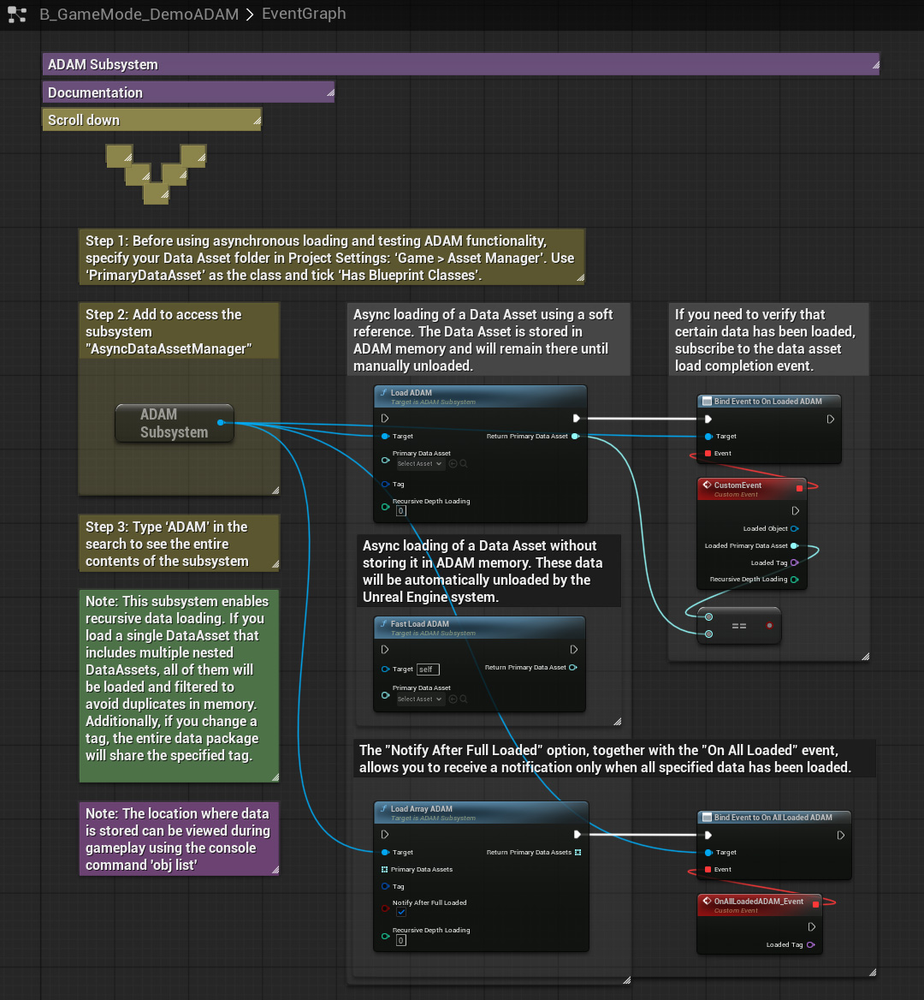
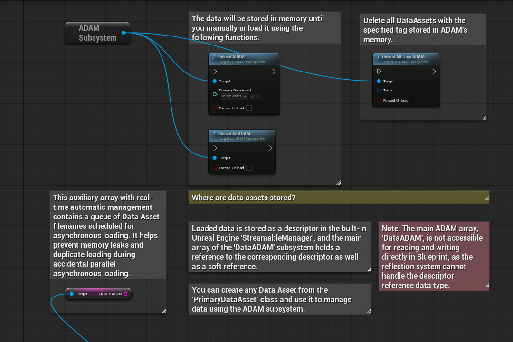

# Async Data Asset Manager
`BETA`  
ADAM is a plugin for Unreal Engine 5 that adds a subsystem for managing asynchronous loading and unloading of Data Assets. This subsystem simplifies the approach to data management, which can be used in both Blueprint and C++.

  <i>(The plugin has been pre-packaged only for Win64 and Android)</i>

# Latest Updates
`Version 1.0`
- Build version for Unreal Engine 5.5.
- Release experimental version of the plugin.

## What it's for
- Load and unload Data Assets asynchronously using simple functions.
- Easily and quickly configure your logic for data management.

## Features
- Fast and simple management of asynchronous Data Asset loading without the need to use C++ code.
- The ADAM subsystem supports parallel asynchronous loading of Data Assets from multiple sources, controlling random duplicate load and unload requests in real-time.
- Supports bulk asynchronous loading of unique Data Assets.
- Supports asynchronous loading without memory retention (e.g., if you need to immediately access data and then free up memory).
- Disableable debug logs allow you to monitor the entire asynchronous data management process. Plugin settings are located in `Project Settings > Plugins > Async Technologies - ADAM`.

## Install
1. Make sure the Unreal Engine editor is closed.
2. Move the "Plugins" folder to the root folder of your created project.
3. Run your project to which the "Plugins" folder with 'AsyncDataAssetManager' was added. If a message about restoring the module appears, select "Yes".
4. Done! The 'Async Data Asset Manager' folders should appear in the Unreal Engine browser and the plugin should be automatically activated. If the plugin folder is not visible, activate visibility through the browser settings: `Settings > Show Plugin Content`.

## How to use it?
An interactive step-by-step tutorial on how to use ADAM can be found in the file: `BP_GameMode_ADAM_demo`, which is located at the path `Plugins\Async Data Asset Manager Content\DemoFiles\`.

## (C++) Documentaion
All sources contain self-documenting code. C++ and BP functions are completely identical and interchangeable.
