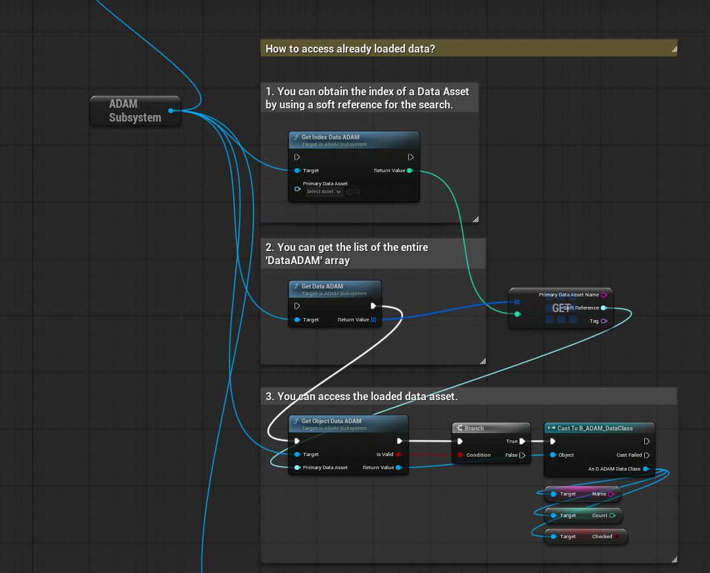

# Async Data Asset Manager
ADAM is a plugin for Unreal Engine 5 that adds a subsystem for asynchronous loading and unloading of Data Assets. This subsystem simplifies data management and can be used in both Blueprints and C++.

 

> [!NOTE]
> The plugin has been pre-packaged only for Win64 and Android.

## Latest Updates
`Version 1.3.0`
- Build version for Unreal Engine 5.5.1
- Refactoring code and improving its readability.
- Expanding self-documenting code and enhancing UX.
- Refined to meet the requirements of a real game project.
- Added optional debug notification for the completion of recursive loading iteration.
- Updated the `LoadArrayADAM` function! Added optional debug notification for the completion of loading all data (works only with `LoadArrayADAM` and `NotifyAfterFullLoaded`). If `NotifyAfterFullLoaded = true`, the `OnAllLoaded` event will notify you when all data in the array has been fully loaded. The ADAM system will ignore duplicate checks (to prevent accidental unloading of necessary data through another thread), so all Data Asset duplicates with this setting will be controlled by the engine's base system.
- Added a new delegate `OnAllLoadedADAM`, which reports the loading of all Data Assets at once. `OnAllLoadedADAM` works only if the `NotifyAfterFullLoaded` option is enabled, which is available only in the `LoadArrayADAM` function.

## What it's for
- Load and unload Data Assets asynchronously using simple functions.
- Easily and quickly configure your logic for data management.

## Features
- Fast and simple management of asynchronous Data Asset loading without the need to use C++ code.
- The ADAM subsystem supports parallel asynchronous loading of Data Assets from multiple sources, controlling random duplicate load and unload requests in real-time.
- Additional duplicate checking ensures that there are no additional references to resources in memory and that they are retained by the standard system.
- Supports bulk asynchronous loading of unique Data Assets.
- This subsystem enables recursive data loading. If you load a single DataAsset that includes multiple nested Data Assets, all of them will be loaded and filtered to avoid duplicates in memory.
- Group your uploaded DataAssets using tags so that they can be unloaded at the right moment <i>(for example, this can be useful if you are uploading DataAssets in parts and want to unload them without affecting other necessary data still stored in memory)</i>.
- Supports asynchronous loading without memory retention <i>(e.g., if you need to immediately access data and then free up memory)</i>.
- Disableable debug logs allow you to monitor the entire asynchronous data management process. Plugin settings are located in `Project Settings > Plugins > Async Technologies - ADAM`.

## Install
1. Make sure the Unreal Engine editor is closed.
2. Move the "Plugins" folder to the root folder of your created project.
3. Run your project to which the "Plugins" folder with 'AsyncDataAssetManager' was added. If a message about restoring the module appears, select "Yes".
4. Done! The 'Async Data Asset Manager' folders should appear in the Unreal Engine browser and the plugin should be automatically activated. If the plugin folder is not visible, activate visibility through the browser settings: `Settings > Show Plugin Content`.

## How to use it?
An interactive step-by-step tutorial on how to use ADAM can be found in the file: `BP_GameMode_ADAM_demo`, which is located at the path `Plugins\Async Data Asset Manager Content\DemoFiles\`.

## (C++) Documentaion
All sources contain self-documenting code.
